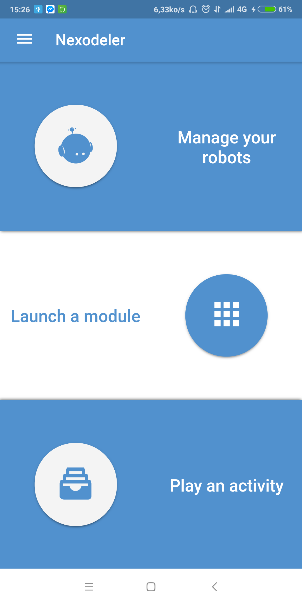
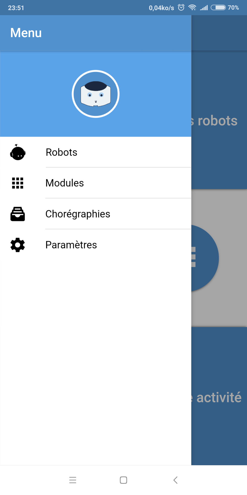

# Nexodeler

The goal of this project is to make an extensible and modular application to control the NAO robot.

## Technologies used

- Angular
- compodoc
- Git
- HTML/HTML5
- Ionic
- JavaScript
- Lazy Loading
- ngx-translate
- NodeJS
- SASS/CSS/CSS3
- TypeScript
- VirtualScroll
- Yarn

## Librairies used

- **QIMessaging** I need it to connect to the robot.
- **Socket.io** I need it to send and receive data from the robot.

## Contribute to the project

1. Install `NodeJS`. Check [https://nodejs.org/en/download/](https://nodejs.org/en/download/);
2. Install `Yarn`. Check [https://yarnpkg.com/lang/en/docs/install](https://yarnpkg.com/lang/en/docs/install);
3. Install the `Angular-Cli`. Run:
> npm install -g @angular/cli
4. Clone the repository;
5. Run this command to install the dependencies:
> yarn install

6. Edit a file that block the connection to the robot. Go in the project folder and edit this file `./node_modules/@ionic/app-scripts/config/uglifyjs.config`

Replace

> mangle: true,

by
> mangle: false,

## Documentation
- Generate the documentation
> yarn run doc:build

- Serve the documentation
> yarn run doc:serve

- Build and serve the documentation
> yarn run doc:buildandserve

## Development server

### Web browser

Run:
> ionic lab -c --debug

**-c** Show the console output.

**--debug** Show more logs.

### Device

Run:
> ionic cordova run platform -c --debug

Where ***platform*** is *ios*, *android* or *windows*.

## Test your code
> yarn run ngc

Don't forget to clean the unwanted files after this test:
> git clean -fd

## Deploy

### Android
#### Simple APK
> ionic cordova build android

or
> ionic cordova run android

#### Production APK
> ionic cordova build android --prod

or
> ionic cordova run android --prod

## Release

### Release APK
> ionic cordova build android --prod --release

Generate a key if you don't have one with:
> keytool -genkey -v -keystore my-release-key.jks -keyalg RSA -keysize 2048 -validity 10000 -alias my-alias

Sign the release with:

> jarsigner -verbose -sigalg SHA1withRSA -digestalg SHA1 -keystore mykey.jks app-release-unsigned.apk my-alias

Optimize the APK with ziptool (`%android-sdk%/Sdk/build-tools/%VERSION%/zipalign`):
> zipalign -v 4 android-release-unsigned.apk MyApplication.apk

Check the APK:
> apksigner verify MyApplication.apk

### Install APK
Use adb where is in `%android-sdk%/Sdk/platform-tools/adb`
> adb install MyApplication.apk

