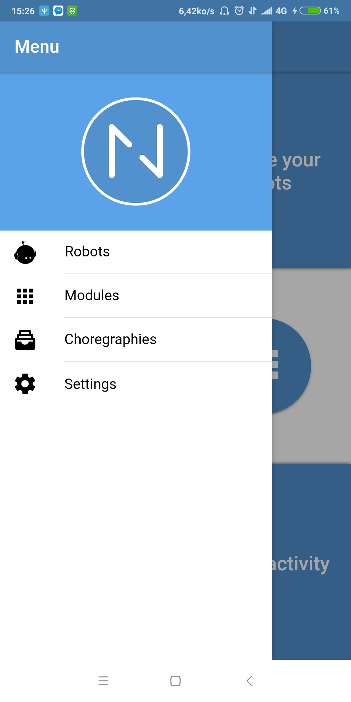

# Nexodeler

The goal of this project is to make an extensible and modular application to control the NAO robot.

## Technologies used

- Angular
- compodoc
- Git
- HTML/HTML5
- Ionic
- JavaScript
- Lazy Loading
- ngx-translate
- NodeJS
- SASS/CSS/CSS3
- TypeScript
- VirtualScroll
- Yarn

## Librairies used

- **QIMessaging** I need it to connect to the robot.
- **Socket.io** I need it to send and receive data from the robot.

This project was generated with [Angular CLI](https://github.com/angular/angular-cli) version 1.6.6.

### Ionic

#### Contribute to the project

1. Install `yarn`;
2. Clone the repository;
3. Run the `yarn install` command.

#### Development server

Run `ionic lab -c --debug` for a dev server.

**OR**

Run `ionic cordova run platform -c --debug` to develop on your device. Where ***platform*** is *ios*, *android* or *windows*.
